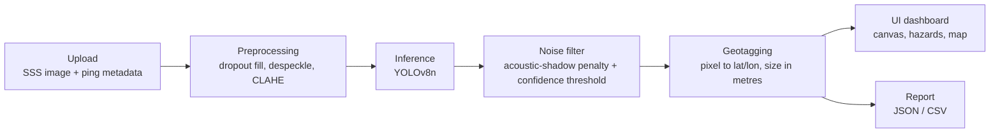

# DeepScan: AI-Powered Underwater Marine Debris & Anomaly Detection

> **SIH Problem Statement ID: `SIH26057`**
> **Ministry of Earth Sciences (MoES) / National Institute of Ocean Technology (NIOT)** · **Theme:** Disaster Management · **Category:** Software

**Team:** `<TEAM NAME>` <!-- FILL BEFORE SUBMISSION -->

<!-- FILL BEFORE SUBMISSION: team members -->
| Member | Role |
|---|---|
| `<Name>` | `<Role>` |

**Live demo:** `https://<your-app>.vercel.app` <!-- FILL BEFORE SUBMISSION -->

---

## Problem Overview

Abandoned, lost and discarded fishing gear, known as **ghost nets**, keeps catching marine life for years, damages coral and seabed habitats, fouls propellers and intakes, and makes up a large share of the plastic in the ocean. Ghost nets, wrecks, exposed pipelines and other debris on the seabed are also hazards for navigation, offshore infrastructure and post-disaster recovery. Finding them across large survey areas is slow: an expert has to review hours of sonar imagery by hand.

**Side-Scan Sonar (SSS)** is the standard tool for imaging the seabed from an AUV or towfish, but its imagery is difficult to interpret automatically. Images are covered in multiplicative **acoustic speckle**, brightness falls off strongly with range, and vehicle pitch, roll and surfacing cause **data dropouts**. Every real object casts an **acoustic shadow**, which is useful evidence but also a common source of false positives. DeepScan cleans the imagery, detects debris and anomalies with a lightweight model, rejects implausible detections, and turns each one into a **geotagged, sized, exportable report**.

## Key Features

- **Object detection:** a YOLOv8n detector for shipwrecks, pipelines, ghost nets and general anomalies. It's small enough to run at the edge.
- **Confidence scoring:** confidence is shown as 0–100% with High / Medium / Low bands (icon + text, not colour alone), and there's an adjustable threshold. Detections that sit inside an acoustic shadow have their score halved to cut false positives.
- **Geotagging engine:** pixel coordinates are converted to latitude/longitude using the AUV's ping positions and heading, with slant-range correction. Each object's size is estimated in metres. Reports export as **JSON and CSV**.
- **SSS-specific preprocessing:** dropout interpolation, then speckle removal (Lee filter / Non-Local Means / median), then CLAHE contrast enhancement.
- **Edge-ready via ONNX:** a one-command export to ONNX (opset 12), checked with onnxruntime. The ONNX file loads with the same detector class.
- **Real-time UI:** a React dashboard with a sonar canvas, scope-style detection brackets, a hazard list, telemetry, a Leaflet mission map, and WCAG AA accessibility.

## Tech Stack

| Layer | Technologies |
|---|---|
| ML / CV | Python, **YOLOv8** (Ultralytics), OpenCV, NumPy, **ONNX** / ONNX Runtime |
| Backend | **FastAPI**, Uvicorn, Pydantic |
| Frontend | **React**, **Vite**, **Tailwind CSS**, **Leaflet** (react-leaflet), **Framer Motion**, Radix UI |
| Tooling | Ruff, GitHub Actions |

## Architecture



See [`docs/ARCHITECTURE.md`](docs/ARCHITECTURE.md) for the component breakdown, API contract and data formats.

## Repository Layout

```
.
├── src/                 # Python backend
│   ├── preprocessing.py # dropout fill, despeckle, CLAHE
│   ├── inference.py     # MarineDebrisDetector (YOLOv8 + shadow penalty)
│   ├── geotagging.py    # GeotaggingEngine, JSON/CSV reports
│   └── api.py           # FastAPI: /upload, /detect, /report/{job_id}
├── scripts/export_onnx.py
├── ui/                  # React + Vite + Tailwind dashboard
├── models/              # weights (git-ignored; yolov8n.pt auto-downloads)
├── data/{raw,processed} # uploads and reports (git-ignored)
└── docs/                # architecture and demo script
```

## Installation & Setup

**Prerequisites:** Python 3.11–3.12 (recommended) and Node.js 20+.

### Backend (FastAPI + model)

```bash
python -m venv .venv
source .venv/bin/activate            # Windows: .venv\Scripts\activate
pip install -r requirements.txt
uvicorn src.api:app --reload --port 8000
```

On the first run, `models/yolov8n.pt` downloads automatically. The interactive API docs are at <http://localhost:8000/docs>.

### Frontend (dashboard)

```bash
cd ui
npm ci
npm run dev                          # http://localhost:5173
```

In development, `/api/*` is proxied to `http://localhost:8000` (see `ui/vite.config.js`). Without the backend, the dashboard still works using the built-in **demo scan**.

### Useful commands

```bash
# Preprocess one image from the command line
python -m src.preprocessing data/raw/scan.png data/processed/scan_clean.png --method lee

# Export the detector to ONNX for edge deployment (writes models/yolov8n.onnx)
python scripts/export_onnx.py --weights models/yolov8n.pt --imgsz 640
```

## Deployment

The frontend and backend deploy **separately**. The React dashboard is a static site on **Vercel**; the FastAPI + YOLOv8 backend runs on **Render** or **Railway**. They're connected by one environment variable, `VITE_API_BASE`.

### Frontend on Vercel (one click)

`vercel.json` lives in the **repository root**. It tells Vercel to install and build inside `ui/` and to serve `ui/dist`, so no *Root Directory* change is needed:

```json
{
  "installCommand": "npm ci --prefix ui",
  "buildCommand": "npm run build --prefix ui",
  "outputDirectory": "ui/dist",
  "rewrites": [{ "source": "/(.*)", "destination": "/index.html" }]
}
```

1. On Vercel, go to **Add New → Project** and import this repository. Leave *Root Directory* as the repo root; the settings above are picked up automatically.
2. Under **Settings → Environment Variables**, add `VITE_API_BASE` = your backend URL (e.g. `https://deepscan-api.onrender.com`, no trailing slash).
3. Click **Deploy**. The CLI alternative is `npm i -g vercel && vercel --prod`.

> `VITE_*` variables are baked in **at build time**. Redeploy the frontend after changing `VITE_API_BASE`. If it's unset, the site still works in **demo mode**, but live detection is disabled.
>
> If you prefer to set *Root Directory* = `ui` in Vercel, move `vercel.json` into `ui/` and keep only its `rewrites` entry.

### Backend on Render (or Railway)

Create a **Web Service** from this repository with:

| Setting | Value |
|---|---|
| Runtime | Python 3.12 (pinned by `.python-version`) |
| Build command | `pip install torch torchvision --index-url https://download.pytorch.org/whl/cpu && pip install -r requirements.txt` |
| Start command | `uvicorn src.api:app --host 0.0.0.0 --port $PORT` |
| Health check path | `/health` |
| Environment | `SSS_DEVICE=cpu`, `SSS_CORS_ORIGINS=https://<your-app>.vercel.app`, optionally `SSS_WEIGHTS`, `SSS_MAX_UPLOAD_MB` |

Railway uses the same build and start commands.

`yolov8n.pt` downloads automatically on first start. PyTorch and Ultralytics need roughly **1–2 GB of RAM**; the smallest free instances (512 MB) may run out of memory. Uploads and reports are stored on the instance's disk and in memory, so they're lost on redeploy.

### Environment variables

Every variable is documented in [`.env.example`](.env.example):

- **Frontend:** `VITE_API_BASE` goes in `ui/.env` locally, or in the Vercel settings.
- **Backend:** `SSS_WEIGHTS`, `SSS_DEVICE`, `SSS_MAX_UPLOAD_MB`, `SSS_CORS_ORIGINS` and `PYTHON_VERSION` are read from the process environment.

## Model Performance

> The weights currently shipped are the **stock COCO-pretrained `yolov8n.pt`**. The four SSS classes need fine-tuning on labelled sonar data (see *Datasets*) before the accuracy figures below can be measured.

| Model | Dataset | mAP@50 | Precision | Recall | Inference (ms) |
|---|---|---|---|---|---|
| YOLOv8n (fine-tuned, SSS) | TBD | TBD | TBD | TBD | TBD |
| YOLOv8n (ONNX, edge) | TBD | TBD | TBD | TBD | TBD |

<!-- FILL BEFORE SUBMISSION: replace TBD with evaluation results -->

**Measured pipeline latency** (prototype, CPU, 1080×810 image, stock weights, warm server): preprocessing ≈ 22 ms, inference ≈ 17–23 ms, geotagging and report ≈ 9 ms.

## Datasets Used

Candidate sources for training and evaluation. **Status: planned (not yet used to train the shipped weights).**

| Dataset | Content | Link |
|---|---|---|
| NOAA (NCEI / Office of Coast Survey) | Hydrographic side-scan sonar surveys | <https://www.ncei.noaa.gov/> (verify) |
| USGS Coastal & Marine Hazards and Resources Program | Sonar and seabed-mapping datasets | <https://www.usgs.gov/programs/cmhrp> (verify) |
| AquaScan-1K | Underwater sonar imagery | TBD <!-- FILL BEFORE SUBMISSION --> |
| AI4Shipwrecks | Labelled side-scan sonar shipwreck imagery | TBD <!-- FILL BEFORE SUBMISSION --> |

## License

Released under the [MIT License](LICENSE).
