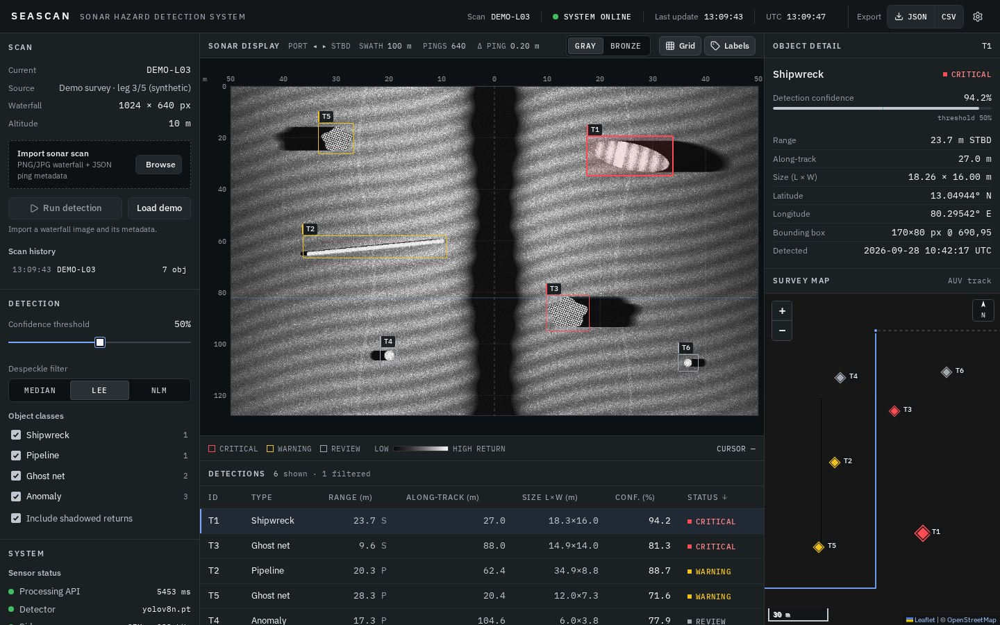
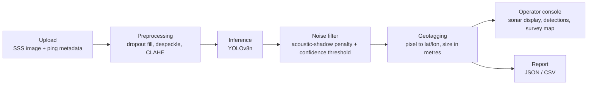

# SEASCAN: AI-Powered Automated Underwater Marine Debris and Anomaly Detection System

[](https://github.com/larpareek/deepscan-sih26057/actions/workflows/ci.yml)
[](LICENSE)

> **SIH Problem Statement ID: `SIH26057`**
>
> **Ministry:** Ministry of Earth Sciences (MoES) / National Institute of Ocean Technology (NIOT)
> **Theme:** Disaster Management | **Category:** Software

**Team Name:** BLACK SWANS

<!-- FILL BEFORE SUBMISSION: team members -->
| Member | Role |
|---|---|
| `<Name>` | `<Role>` |

### Live Demo

| | URL |
|---|---|
| **Web app (Vercel)** | <https://deepscan-sih26057-lilac.vercel.app> |
| **Backend API (Railway)** | <https://deepscan-api-production.up.railway.app> · interactive docs: [`/docs`](https://deepscan-api-production.up.railway.app/docs) |

Click **Load demo survey** for an instant walkthrough (runs in the browser), or import a sonar image and its ping metadata to run the full pipeline on the live backend.



---

## Problem Overview

Abandoned, lost and discarded fishing gear, known as **ghost nets**, keeps catching marine life for years, damages coral and seabed habitats, fouls propellers and intakes, and makes up a large share of the plastic in the ocean. Ghost nets, wrecks, exposed pipelines and other debris on the seabed are also hazards for navigation, offshore infrastructure and post-disaster recovery. Finding them across large survey areas is slow: an expert has to review hours of sonar imagery by hand.

**Side-Scan Sonar (SSS)** is the standard tool for imaging the seabed from an AUV or towfish, but its imagery is difficult to interpret automatically. Images are covered in multiplicative **acoustic speckle**, brightness falls off strongly with range, and vehicle pitch, roll and surfacing cause **data dropouts**. Every real object casts an **acoustic shadow**, which is useful evidence but also a common source of false positives. SEASCAN cleans the imagery, detects debris and anomalies with a lightweight model, rejects implausible detections, and turns each one into a **geotagged, sized, exportable report**.

## Key Features

- **Object detection:** a YOLOv8n detector for shipwrecks, pipelines, ghost nets and general anomalies. It's small enough to run at the edge.
- **Confidence scoring and hazard status:** each detection carries a 0–100% confidence with an adjustable threshold, and a status of CRITICAL / WARNING / REVIEW shown as text and colour. Detections that sit inside an acoustic shadow have their score halved to cut false positives.
- **Geotagging engine:** pixel coordinates are converted to latitude/longitude using the AUV's ping positions and heading, with slant-range correction. Each object's size is estimated in metres. Reports export as **JSON and CSV**.
- **SSS-specific preprocessing:** dropout interpolation, then speckle removal (Lee filter / Non-Local Means / median), then CLAHE contrast enhancement.
- **Edge-ready via ONNX:** a one-command export to ONNX (opset 12), checked with onnxruntime. The ONNX file loads with the same detector class.
- **Operator console UI:** a sonar-workstation interface with a calibrated sonar display (range and along-track axes, cursor readout), status-coded detections (CRITICAL / WARNING / REVIEW), a sortable detections table, a survey map, processing-pipeline timings, and WCAG 2.2 AA accessibility.

## Tech Stack

| Layer | Technologies |
|---|---|
| **AI / ML** | Python 3.12, **PyTorch** (CPU build), **YOLOv8** (Ultralytics, `yolov8n`), **OpenCV**, NumPy, **ONNX** + ONNX Runtime (edge export) |
| **Backend** | **FastAPI**, **Uvicorn**, **Pydantic**, python-multipart |
| **Frontend** | **React** 18, **Vite**, **Tailwind CSS**, **Leaflet** (react-leaflet), Radix UI (tooltips, popovers), Lucide icons, IBM Plex type |
| **Deployment** | **Vercel** (frontend), **Railway** (backend, Docker image), **GitHub Actions** (CI: Ruff lint + frontend build) |

## Architecture



See [`docs/ARCHITECTURE.md`](docs/ARCHITECTURE.md) for the component breakdown, API contract and data formats.

## Repository Layout

```
.
├── src/                 # Python backend
│   ├── preprocessing.py # dropout fill, despeckle, CLAHE
│   ├── inference.py     # MarineDebrisDetector (YOLOv8 + shadow penalty)
│   ├── geotagging.py    # GeotaggingEngine, JSON/CSV reports
│   └── api.py           # FastAPI: /upload, /detect, /report/{job_id}
├── scripts/
│   ├── generate_synthetic.py  # labelled synthetic SSS dataset (YOLO format)
│   ├── train_detector.py      # fine-tune YOLOv8n -> models/seascan-yolov8n.pt
│   └── export_onnx.py
├── tests/               # pytest: preprocessing, geotagging, synthetic data
├── ui/                  # React + Vite + Tailwind operator console
├── models/              # weights (git-ignored; yolov8n.pt auto-downloads)
├── data/{raw,processed} # uploads and reports (git-ignored)
└── docs/                # architecture, demo script, screenshots
```

## Installation & Setup

**Prerequisites:** Python 3.11–3.12 (recommended) and Node.js 20+.

### Backend (FastAPI + model)

```bash
python -m venv .venv
source .venv/bin/activate            # Windows: .venv\Scripts\activate
pip install -r requirements.txt
uvicorn src.api:app --reload --port 8000
```

On the first run, `models/yolov8n.pt` downloads automatically. The interactive API docs are at <http://localhost:8000/docs>.

### Frontend (dashboard)

```bash
cd ui
npm ci
npm run dev                          # http://localhost:5173
```

In development, `/api/*` is proxied to `http://localhost:8000` (see `ui/vite.config.js`). Without the backend, the dashboard still works using the built-in **demo scan**.

### Tests

```bash
pip install pytest
pytest -q          # 24 tests: preprocessing (dropouts, speckle, CLAHE), geotagging (pixel -> lat/lon, reports), synthetic data
```

CI runs Ruff, these tests and the frontend build on every push.

### Useful commands

```bash
# Preprocess one image from the command line
python -m src.preprocessing data/raw/scan.png data/processed/scan_clean.png --method lee

# Export the detector to ONNX for edge deployment (writes models/yolov8n.onnx)
python scripts/export_onnx.py --weights models/seascan-yolov8n.pt --imgsz 640
```

## Deployment

The frontend and backend deploy **separately**. The React dashboard is a static site on **Vercel**; the FastAPI + YOLOv8 backend runs on **Railway** (Render also supported). They're connected by one environment variable, `VITE_API_BASE`.

**Current live deployment**

| Part | Host | Details |
|---|---|---|
| Frontend | Vercel | Project root `ui/`, Vite preset, auto-deploys from `main`; `VITE_API_BASE` = the Railway URL |
| Backend | Railway | Service `deepscan-api` built from the `Dockerfile`; `SSS_CORS_ORIGINS` = the Vercel URL |

> Use the production URL above. Vercel's per-deployment preview links serve older builds, and the backend's CORS policy only accepts the production origin.

To redeploy the backend after changes in `src/`: `railway up --service deepscan-api` from the repo root. Frontend changes deploy automatically on every push to `main`.

### Frontend on Vercel

The frontend lives in `ui/`, and **`ui/vercel.json`** holds its Vercel config (Vite preset, SPA rewrites). The repo root also contains the Python backend, so Vercel must be pointed at `ui/`. Otherwise it auto-detects a FastAPI app and the build fails.

1. On Vercel, go to **Add New → Project** and import this repository.
2. Set **Root Directory** to `ui` and **Framework Preset** to **Vite**. For an existing project, change these under **Settings → Build and Deployment**.
3. Under **Settings → Environment Variables**, add `VITE_API_BASE` = your backend URL (e.g. `https://deepscan-api-production.up.railway.app`, no trailing slash).
4. Click **Deploy**. The CLI alternative is `cd ui && npx vercel --prod`.

> `VITE_*` variables are baked in **at build time**. Redeploy the frontend after changing `VITE_API_BASE`. If it's unset, the site still works in **demo mode**, but live detection is disabled.

### Backend on Railway or Render (Docker)

The backend ships as a **`Dockerfile`**. It installs CPU-only PyTorch, bakes in `yolov8n.pt`, binds to `$PORT` and exposes `/health`. Any Docker host works.

> The backend uses about **550 MB of RAM** (measured), so 512 MB instances (Render Free/Starter) will run out of memory. Use a plan with **at least 1 GB**.

**Railway (recommended):** `railway.json` selects the Dockerfile and health check.

```bash
npm i -g @railway/cli
railway login
railway init            # create a project
railway up              # build and deploy the Dockerfile
railway domain          # generate a public URL
railway variables --set "SSS_CORS_ORIGINS=https://<your-app>.vercel.app"
```

**Render:** `render.yaml` is a Blueprint. In the dashboard, go to **New → Blueprint**, select this repo, and enter `SSS_CORS_ORIGINS` when prompted. It uses the *Standard* (2 GB) plan.

**Then connect the two:**
1. In Vercel, set `VITE_API_BASE` to the backend URL and **redeploy** the frontend.
2. Check that `https://<backend>/health` returns `{"status":"ok",…}`.

Uploads and reports are kept on the container's disk and in memory, so they're lost on redeploy.

### Environment variables

Every variable is documented in [`.env.example`](.env.example):

- **Frontend:** `VITE_API_BASE` goes in `ui/.env` locally, or in the Vercel settings.
- **Backend:** `SSS_WEIGHTS`, `SSS_DEVICE`, `SSS_MAX_UPLOAD_MB`, `SSS_CORS_ORIGINS` and `PYTHON_VERSION` are read from the process environment.

## Model Performance

The shipped detector, `models/seascan-yolov8n.pt`, is YOLOv8n fine-tuned for 40 epochs (CPU) on **SEASCAN-Synth**, a labelled synthetic side-scan dataset produced by our physics-based simulator (speckle, range falloff, nadir gap, acoustic shadows, dropped pings). Every image goes through the same preprocessing as live inference.

| Model | Evaluation set | mAP@50 | mAP@50-95 | Precision | Recall | Inference (ms, CPU) |
|---|---|---|---|---|---|---|
| YOLOv8n SEASCAN (PyTorch) | SEASCAN-Synth val (240 images, 656 objects) | 0.995 | 0.940 | 0.999 | 0.999 | ≈ 15 |
| YOLOv8n SEASCAN (ONNX, edge) | same weights, onnxruntime | n/a | n/a | n/a | n/a | ≈ 13 |
| YOLOv8n SEASCAN | Real SSS surveys (AI4Shipwrecks etc.) | TBD | TBD | TBD | TBD | TBD |

Per class (mAP@50-95): shipwreck 0.975 · pipe 0.960 · ghost_net 0.951 · anomaly 0.873. On 30 target-free synthetic scenes it produced 0 false positives.

> **Honest caveat:** these figures are measured on *synthetic* sonar, which is cleaner and more regular than real surveys, so they are an upper bound. Real-data accuracy is the first roadmap item. Reproduce with:
> `python scripts/generate_synthetic.py --out data/synthetic --train 1200 --val 240 && python scripts/train_detector.py --data data/synthetic/seascan.yaml`

**Measured pipeline latency** (1080×810 image, warm server):

| Environment | Preprocessing | Inference + shadow filter | Geotag + report |
|---|---|---|---|
| Laptop CPU (local) | ≈ 22 ms | ≈ 17–23 ms | ≈ 9 ms |
| Railway CPU (live deployment) | ≈ 33–70 ms | ≈ 25–250 ms | ≈ 15–80 ms |

## Datasets Used

**Used:** SEASCAN-Synth, generated by `scripts/generate_synthetic.py` (1,200 train / 240 val images, 1024×640, seed 26057, classes shipwreck / pipe / ghost_net / anomaly).

**Planned** for real-data fine-tuning and evaluation:

| Dataset | Content | Link |
|---|---|---|
| NOAA (NCEI / Office of Coast Survey) | Hydrographic side-scan sonar surveys | <https://www.ncei.noaa.gov/> (verify) |
| USGS Coastal & Marine Hazards and Resources Program | Sonar and seabed-mapping datasets | <https://www.usgs.gov/programs/cmhrp> (verify) |
| AquaScan-1K | Underwater sonar imagery | TBD <!-- FILL BEFORE SUBMISSION --> |
| AI4Shipwrecks | Labelled side-scan sonar shipwreck imagery | TBD <!-- FILL BEFORE SUBMISSION --> |

## Roadmap

- **Real-data fine-tuning:** continue from the synthetic weights on labelled side-scan surveys (AI4Shipwrecks, NOAA/USGS, NIOT data) and report real-world accuracy.
- **Motion compensation:** use roll, pitch and heading from the ping headers in geotagging; today the across-track model is linear with slant-range correction.
- **Native survey formats:** read XTF/JSF sonar files and export georeferenced GeoTIFF mosaics (the `rasterio` dependency is in place for this).
- **Persistent job store** (database + object storage) instead of in-memory jobs, and live telemetry streaming from the vehicle.
- **On-vehicle inference** with the ONNX export on an embedded GPU (e.g. Jetson).

## License

Released under the [MIT License](LICENSE).
