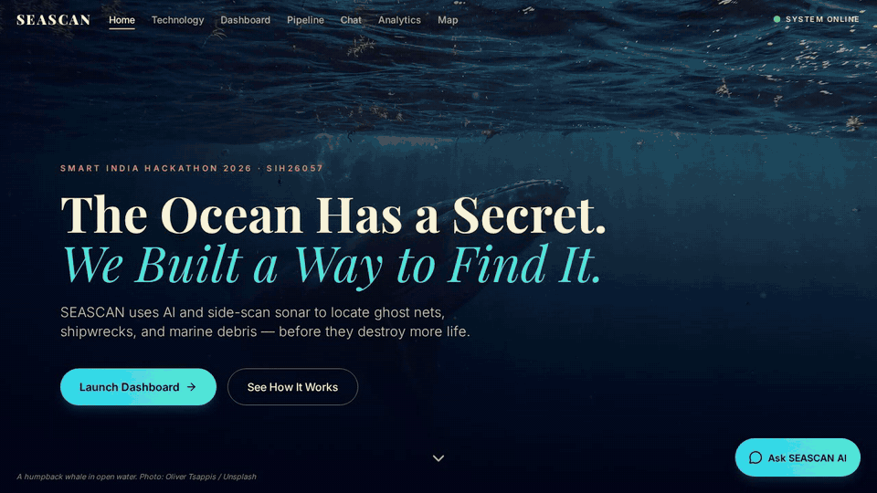
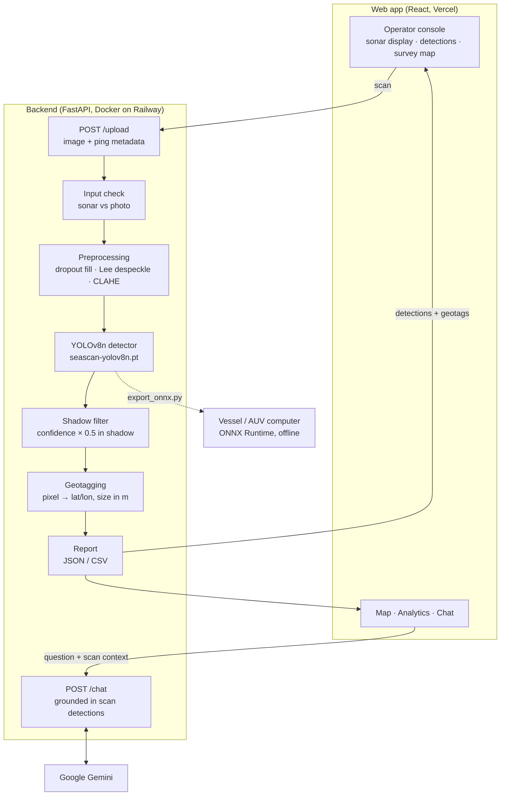
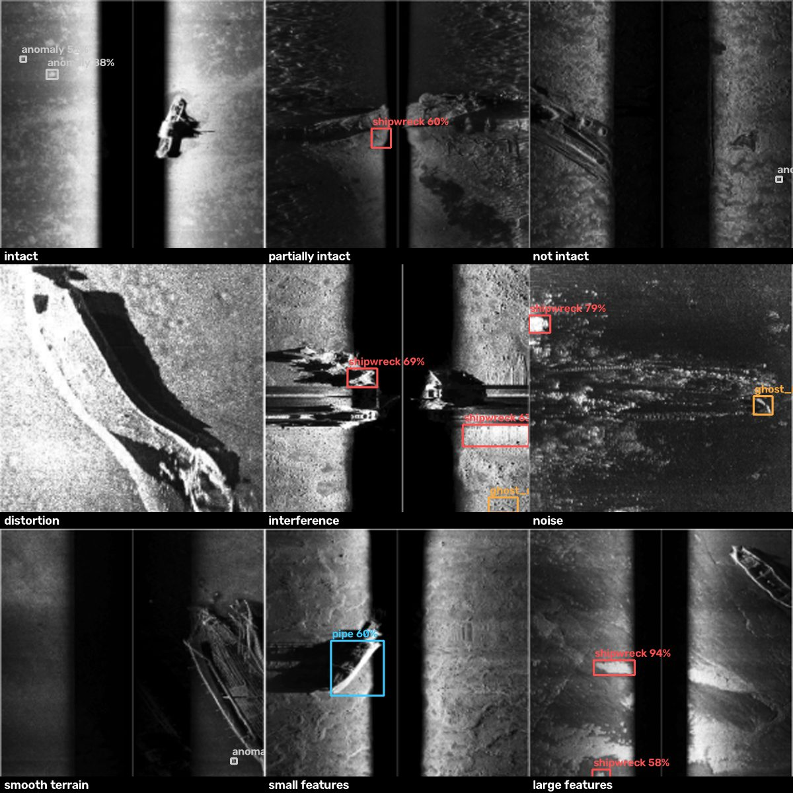

# SEASCAN: AI-Powered Automated Underwater Marine Debris and Anomaly Detection System

[](https://github.com/larpareek/deepscan-sih26057/actions/workflows/ci.yml)
[](LICENSE)

| | |
|---|---|
| **Problem Statement** | **SIH26057**: AI-Powered Automated Underwater Marine Debris and Anomaly Detection System |
| **Ministry / Organisation** | Ministry of Earth Sciences (MoES) / National Institute of Ocean Technology (NIOT) |
| **Theme · Category** | Disaster Management · Software |
| **Team** | **BLACK SWANS** |

### Team BLACK SWANS

| | Member |
|---|---|
| 1 | Arkin |
| 2 | Kirti Sakuja |
| 3 | Arjun Shandilya |
| 4 | Aditya Pareek |
| 5 | Aayush Saroha |
| 6 | Aryan Dhiman |

### Live Demo

| | URL |
|---|---|
| **Web app (Vercel)** | <https://deepscan-sih26057-lilac.vercel.app> |
| **Backend API (Railway)** | <https://deepscan-api-production.up.railway.app> · interactive docs: [`/docs`](https://deepscan-api-production.up.railway.app/docs) |

Click **Load demo survey** for an instant walkthrough (runs in the browser), or import a sonar image and its ping metadata to run the full pipeline on the live backend.



<sub>20-second walkthrough of the live site. Still screenshot: [`docs/images/seascan-console.jpg`](docs/images/seascan-console.jpg).</sub>

---

## Problem Statement (SIH26057)

**Organisation:** National Institute of Ocean Technology (NIOT), Ministry of Earth Sciences. NIOT develops ocean technology for India's seas, including underwater vehicles and seabed surveys, where side-scan sonar is a primary imaging tool.

**The ask, as we read it:** build an AI-powered, automated system that finds marine debris and anomalies in underwater sonar imagery, so that surveys no longer depend on experts reviewing hours of data by hand.

| What the problem needs | How SEASCAN addresses it | Where |
|---|---|---|
| **Automated detection** of debris and anomalies | YOLOv8n detector for ghost nets, shipwrecks, pipelines and unclassified anomalies, with a 0–100% confidence per object | `src/inference.py` |
| Works on **real sonar conditions** (speckle, range fading, dropouts) | SSS-specific preprocessing: dropout repair → Lee / NLM / median despeckle → CLAHE | `src/preprocessing.py` |
| **Few false alarms** for survey teams | Acoustic-shadow physics check halves confidence of shadow-only boxes; non-sonar uploads are flagged | `src/inference.py`, `src/preprocessing.py` |
| **Precise location** of every finding | Pixel → latitude/longitude from the ping track with slant-range correction; size in metres | `src/geotagging.py` |
| **Actionable output** | Hazard status (CRITICAL / WARNING / REVIEW), JSON/CSV reports, survey map, plain-language Q&A (SEASCAN AI) | `src/api.py`, `ui/` |
| **Deployable on vessels / AUVs** | 12 MB ONNX model, ≈ 13 ms per image on CPU, no internet needed | `scripts/export_onnx.py` |
| **Low latency** for operators | Whole pipeline < 50 ms per scan on a laptop CPU; async FastAPI backend | `src/api.py` |

> The table reflects our reading of the problem statement title and NIOT's survey context. Accuracy on real survey data is not yet established; see [Real-sonar check](#real-sonar-check).

## Problem Overview

Abandoned, lost and discarded fishing gear, known as **ghost nets**, keeps catching marine life for years, damages coral and seabed habitats, fouls propellers and intakes, and makes up a large share of the plastic in the ocean. Ghost nets, wrecks, exposed pipelines and other debris on the seabed are also hazards for navigation, offshore infrastructure and post-disaster recovery. Finding them across large survey areas is slow: an expert has to review hours of sonar imagery by hand.

**Side-Scan Sonar (SSS)** is the standard tool for imaging the seabed from an AUV or towfish, but its imagery is difficult to interpret automatically. Images are covered in multiplicative **acoustic speckle**, brightness falls off strongly with range, and vehicle pitch, roll and surfacing cause **data dropouts**. Every real object casts an **acoustic shadow**, which is useful evidence but also a common source of false positives. SEASCAN cleans the imagery, detects debris and anomalies with a lightweight model, rejects implausible detections, and turns each one into a **geotagged, sized, exportable report**.

## Key Features

- **Object detection:** a YOLOv8n detector for shipwrecks, pipelines, ghost nets and general anomalies. It's small enough to run at the edge.
- **Confidence scoring and hazard status:** each detection carries a 0–100% confidence with an adjustable threshold, and a status of CRITICAL / WARNING / REVIEW shown as text and colour. Detections that sit inside an acoustic shadow have their score halved to cut false positives.
- **Geotagging engine:** pixel coordinates are converted to latitude/longitude using the AUV's ping positions and heading, with slant-range correction. Each object's size is estimated in metres. Reports export as **JSON and CSV**.
- **SSS-specific preprocessing:** dropout interpolation, then speckle removal (Lee filter / Non-Local Means / median), then CLAHE contrast enhancement.
- **Edge-ready via ONNX:** a one-command export to ONNX (opset 12), checked with onnxruntime. The ONNX file loads with the same detector class.
- **SEASCAN AI (Gemini):** ask questions about the current scan in plain language ("What is the most dangerous hazard here?", "What is the closest ghost net to Chennai?"). The backend grounds every answer in the scan's detections and coordinates; the API key never reaches the browser. If Gemini is unavailable, a deterministic summary answers instead.
- **Multi-page site:** an editorial landing page, a Technology explainer with an animated towed-sonar diagram, an animated Pipeline walkthrough, a full-page Chat, Analytics (your session's scans and the detector's measured validation results), and a full-screen Map.
- **Operator console UI:** a sonar-workstation interface with a calibrated sonar display (range and along-track axes, cursor readout), status-coded detections (CRITICAL / WARNING / REVIEW), a sortable detections table, a survey map, processing-pipeline timings, and WCAG 2.2 AA accessibility.

## Tech Stack

| Layer | Technologies |
|---|---|
| **AI / ML** | Python 3.12, **PyTorch** (CPU build), **YOLOv8** (Ultralytics, `yolov8n`), **OpenCV**, NumPy, **ONNX** + ONNX Runtime (edge export) |
| **Backend** | **FastAPI**, **Uvicorn**, **Pydantic**, python-multipart, **Google Gemini** (`google-genai`) for SEASCAN AI |
| **Frontend** | **React** 18, **Vite**, **Tailwind CSS**, **React Router**, **Framer Motion**, **Recharts**, **Leaflet** (react-leaflet), Radix UI, Lucide icons; Playfair Display + Inter (site), IBM Plex (console) |
| **Deployment** | **Vercel** (frontend), **Railway** (backend, Docker image), **GitHub Actions** (CI: Ruff lint + frontend build) |

## Architecture



See [`docs/ARCHITECTURE.md`](docs/ARCHITECTURE.md) for the component breakdown, API contract and data formats.

## Repository Layout

```
.
├── src/                 # Python backend
│   ├── preprocessing.py # dropout fill, despeckle, CLAHE
│   ├── inference.py     # MarineDebrisDetector (YOLOv8 + shadow penalty)
│   ├── geotagging.py    # GeotaggingEngine, JSON/CSV reports
│   └── api.py           # FastAPI: /upload, /detect, /report/{job_id}
├── scripts/
│   ├── generate_synthetic.py  # labelled synthetic SSS dataset (YOLO format)
│   ├── train_detector.py      # fine-tune YOLOv8n -> models/seascan-yolov8n.pt
│   ├── export_onnx.py
│   ├── download_weights.py    # fetch + checksum the trained detector if missing
│   └── deploy_hf_space.py     # optional free backend host
├── tests/               # pytest: preprocessing, geotagging, synthetic data
├── ui/                  # React + Vite site: landing, technology, pipeline, dashboard, chat, analytics, map
├── models/              # seascan-yolov8n.pt (trained detector, committed, 6.2 MB)
├── data/{raw,processed} # uploads and reports (git-ignored)
└── docs/                # architecture, demo script, screenshots
```

## Installation & Setup

**Prerequisites:** Python 3.11–3.12 (recommended) and Node.js 20+.

### Backend (FastAPI + model)

```bash
python -m venv .venv
source .venv/bin/activate            # Windows: .venv\Scripts\activate
pip install -r requirements.txt
python scripts/download_weights.py   # checks models/seascan-yolov8n.pt (already in the repo) and fetches it if missing
uvicorn src.api:app --reload --port 8000
```

**Model weights:** the trained detector `models/seascan-yolov8n.pt` (6.2 MB) is committed, so a normal clone can run immediately; every other `.pt`/`.onnx` file in `models/` is git-ignored. If it's missing (e.g. a partial download), `scripts/download_weights.py` fetches it from this repository and verifies its SHA-256. To rebuild it from scratch, see [Model Performance](#model-performance).

The interactive API docs are at <http://localhost:8000/docs>.

For SEASCAN AI, put your key in `src/.env` (git-ignored): `GEMINI_API_KEY=...`. Without it, `/chat` still answers with an automatic summary.

### Frontend (dashboard)

```bash
cd ui
npm ci
npm run dev                          # http://localhost:5173
```

In development, `/api/*` is proxied to `http://localhost:8000` (see `ui/vite.config.js`). Without the backend, the dashboard still works using the built-in **demo scan**.

### Tests

```bash
pip install pytest
pytest -q          # 30 tests: preprocessing, geotagging, synthetic data, SEASCAN AI chat helpers
```

CI runs Ruff, these tests and the frontend build on every push.

### Useful commands

```bash
# Preprocess one image from the command line
python -m src.preprocessing data/raw/scan.png data/processed/scan_clean.png --method lee

# Export the detector to ONNX for edge deployment (writes models/seascan-yolov8n.onnx)
python scripts/export_onnx.py --weights models/seascan-yolov8n.pt --imgsz 640
```

## Deployment

The frontend and backend deploy **separately**. The React dashboard is a static site on **Vercel**; the FastAPI + YOLOv8 backend runs on **Railway** (Render also supported). They're connected by one environment variable, `VITE_API_BASE`.

**Current live deployment**

| Part | Host | Details |
|---|---|---|
| Frontend | Vercel | Project root `ui/`, Vite preset, auto-deploys from `main`; `VITE_API_BASE` = the Railway URL |
| Backend | Railway | Service `deepscan-api` built from the `Dockerfile`; `SSS_CORS_ORIGINS` = the Vercel URL |

> Use the production URL above. Vercel's per-deployment preview links serve older builds, and the backend's CORS policy only accepts the production origin.

To redeploy the backend after changes in `src/`: `railway up --service deepscan-api` from the repo root. Frontend changes deploy automatically on every push to `main`.

### Frontend on Vercel

The frontend lives in `ui/`, and **`ui/vercel.json`** holds its Vercel config (Vite preset, SPA rewrites). The repo root also contains the Python backend, so Vercel must be pointed at `ui/`. Otherwise it auto-detects a FastAPI app and the build fails.

1. On Vercel, go to **Add New → Project** and import this repository.
2. Set **Root Directory** to `ui` and **Framework Preset** to **Vite**. For an existing project, change these under **Settings → Build and Deployment**.
3. Under **Settings → Environment Variables**, add `VITE_API_BASE` = your backend URL (e.g. `https://deepscan-api-production.up.railway.app`, no trailing slash).
4. Click **Deploy**. The CLI alternative is `cd ui && npx vercel --prod`.

> `VITE_*` variables are baked in **at build time**. Redeploy the frontend after changing `VITE_API_BASE`. If it's unset, the site still works in **demo mode**, but live detection is disabled.

### Backend on Railway or Render (Docker)

The backend ships as a **`Dockerfile`**. It installs CPU-only PyTorch, bakes in `models/seascan-yolov8n.pt`, binds to `$PORT` and exposes `/health`. Any Docker host works.

> The backend uses about **550 MB of RAM** (measured), so 512 MB instances (Render Free/Starter) will run out of memory. Use a plan with **at least 1 GB**.

**Railway (recommended):** `railway.json` selects the Dockerfile and health check.

```bash
npm i -g @railway/cli
railway login
railway init            # create a project
railway up              # build and deploy the Dockerfile
railway domain          # generate a public URL
railway variables --set "SSS_CORS_ORIGINS=https://<your-app>.vercel.app"
```

**Render:** `render.yaml` is a Blueprint. In the dashboard, go to **New → Blueprint**, select this repo, and enter `SSS_CORS_ORIGINS` when prompted. It uses the *Standard* (2 GB) plan.

**Then connect the two:**
1. In Vercel, set `VITE_API_BASE` to the backend URL and **redeploy** the frontend.
2. Check that `https://<backend>/health` returns `{"status":"ok",…}`.

Uploads and reports are kept on the container's disk and in memory, so they're lost on redeploy.

### Backend on Hugging Face Spaces (free)

A free Docker Space has enough memory for the PyTorch backend. It sleeps after about two days without traffic and wakes on the next request.

```bash
pip install huggingface_hub
export HF_TOKEN=<token with write access>
python scripts/deploy_hf_space.py --space <username>/seascan-api --cors https://<your-app>.vercel.app
```

The script creates the Space, stores `GEMINI_API_KEY` as a Space secret and uploads only the backend files. Then set `VITE_API_BASE` in Vercel to `https://<username>-seascan-api.hf.space` and redeploy.

### Environment variables

Every variable is documented in [`.env.example`](.env.example):

- **Frontend:** `VITE_API_BASE` goes in `ui/.env` locally, or in the Vercel settings.
- **Backend:** `SSS_WEIGHTS`, `SSS_DEVICE`, `SSS_MAX_UPLOAD_MB`, `SSS_CORS_ORIGINS` and `PYTHON_VERSION` are read from the process environment.
- **SEASCAN AI:** `GEMINI_API_KEY` (required for Gemini answers; server-side only), optional `GEMINI_MODELS` (comma-separated fallback order, default `gemini-flash-lite-latest,gemini-flash-latest,gemini-2.5-flash`) and `SSS_CHAT_PER_MIN` (per-client rate limit, default 12).

## Model Performance

The shipped detector, `models/seascan-yolov8n.pt`, is YOLOv8n fine-tuned for 40 epochs (CPU) on **SEASCAN-Synth**, a labelled synthetic side-scan dataset produced by our physics-based simulator (speckle, range falloff, nadir gap, acoustic shadows, dropped pings). Every image goes through the same preprocessing as live inference.

| Model | Evaluation set | mAP@50 | mAP@50-95 | Precision | Recall | Inference (ms, CPU) |
|---|---|---|---|---|---|---|
| YOLOv8n SEASCAN (PyTorch) | SEASCAN-Synth val (240 images, 656 objects) | 0.995 | 0.940 | 0.999 | 0.999 | ≈ 15 |
| YOLOv8n SEASCAN (ONNX, edge) | same weights, onnxruntime | n/a | n/a | n/a | n/a | ≈ 13 |
| YOLOv8n SEASCAN | Real SSS: 9 AI4Shipwrecks tiles (qualitative) | wreck located in 2 / 9 | n/a | n/a | n/a | ≈ 15 |

Per class (mAP@50-95): shipwreck 0.975 · pipe 0.960 · ghost_net 0.951 · anomaly 0.873. On 30 target-free synthetic scenes it produced 0 false positives.

> **Honest caveat:** these figures are measured on *synthetic* sonar, which is cleaner and more regular than real surveys, so they are an upper bound. Real-data accuracy is the first roadmap item. Reproduce with:
> `python scripts/generate_synthetic.py --out data/synthetic --train 1200 --val 240 && python scripts/train_detector.py --data data/synthetic/seascan.yaml`

### Real-sonar check

To see how the synthetic-trained model behaves on real data, we ran it, unchanged, on the nine real side-scan tiles of Great Lakes shipwrecks published on the [AI4Shipwrecks](https://umfieldrobotics.github.io/ai4shipwrecks/) project site (EdgeTech 2205 sonar on an Iver3 AUV, Thunder Bay National Marine Sanctuary; University of Michigan Field Robotics Group). Every tile contains a wreck. Tiles were upscaled to 640 px and passed through the normal SEASCAN preprocessing; boxes ≥ 50% confidence are shown.



<sub>Sonar imagery © University of Michigan Field Robotics Group (AI4Shipwrecks), from the project website, used here for non-commercial evaluation. Boxes and labels are SEASCAN output.</sub>

**Result:** the wreck was located in **2 of 9** tiles ("interference", and "small features" where it was labelled as a pipeline). The model missed the clearly visible wreck in "intact" and several others, and raised false alarms on bright seabed patches.

**What this means:** the detector has learned our simulator, not yet real sonar. This is the expected synthetic-to-real gap, and closing it is our first priority: fine-tune the existing weights on the labelled AI4Shipwrecks dataset and NIOT survey data. The pipeline (preprocessing, shadow filter, geotagging, reports, UI) is model-agnostic, so improved weights drop in without code changes.

**Measured pipeline latency** (1080×810 image, warm server):

| Environment | Preprocessing | Inference + shadow filter | Geotag + report |
|---|---|---|---|
| Laptop CPU (local) | ≈ 22 ms | ≈ 17–23 ms | ≈ 9 ms |
| Railway CPU (live deployment) | ≈ 33–70 ms | ≈ 25–250 ms | ≈ 15–80 ms |

## Datasets Used

**Used:** SEASCAN-Synth, generated by `scripts/generate_synthetic.py` (1,200 train / 240 val images, 1024×640, seed 26057, classes shipwreck / pipe / ghost_net / anomaly).

**Planned** for real-data fine-tuning and evaluation:

| Dataset | Content | Link |
|---|---|---|
| NOAA (NCEI / Office of Coast Survey) | Hydrographic side-scan sonar surveys | <https://www.ncei.noaa.gov/> |
| USGS Coastal & Marine Hazards and Resources Program | Sonar and seabed-mapping datasets | <https://www.usgs.gov/programs/cmhrp> |
| AI4Shipwrecks (University of Michigan, NOAA-funded) | Labelled side-scan sonar shipwreck imagery | <https://umfieldrobotics.github.io/ai4shipwrecks/> |

## Roadmap

- **Real-data fine-tuning:** continue from the synthetic weights on labelled side-scan surveys (AI4Shipwrecks, NOAA/USGS, NIOT data) and report real-world accuracy.
- **Motion compensation:** use roll, pitch and heading from the ping headers in geotagging; today the across-track model is linear with slant-range correction.
- **Native survey formats:** read XTF/JSF sonar files and export georeferenced GeoTIFF mosaics (the `rasterio` dependency is in place for this).
- **Persistent job store** (database + object storage) instead of in-memory jobs, and live telemetry streaming from the vehicle.
- **On-vehicle inference** with the ONNX export on an embedded GPU (e.g. Jetson).

## Security

See [`SECURITY.md`](SECURITY.md) for how to report a vulnerability privately and how the prototype handles uploads and secrets.

## License

Released under the [MIT License](LICENSE).
