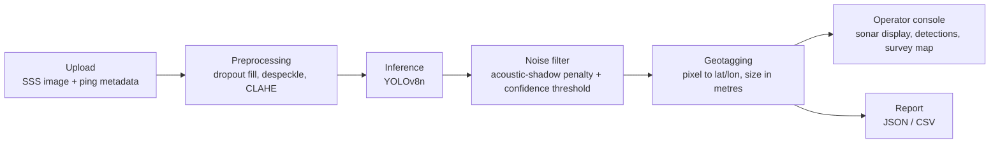
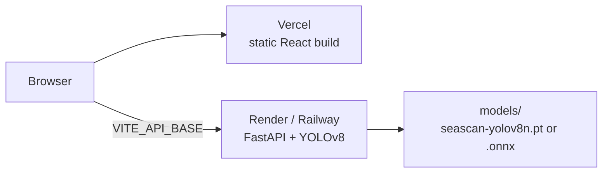

# SEASCAN Architecture (SIH26057)

SEASCAN has two independently deployable parts:

- A **Python backend** (`src/`) that turns a side-scan sonar (SSS) image plus its ping metadata into geotagged detections.
- A **React dashboard** (`ui/`) for reviewing them.

## Pipeline



**Image convention:**
- Each row is one **ping** (along-track, direction of travel).
- Each column is one **range sample** (across-track).
- In a dual-channel waterfall, the centre column is **nadir**: port is on the left, starboard on the right.

### 1. Preprocessing (`src/preprocessing.py`)

| Step | Function | Defaults | Why |
|---|---|---|---|
| Dropout repair | `fill_dropouts` | pings with ≥ 90% missing samples are interpolated along-track; remaining holes are filled by Telea inpainting (radius 3) | AUV pitch/roll spikes and comms loss leave blank pings |
| Despeckle | `despeckle(method=…)` | `lee` (7×7 window), `nlm` or `median` | Sonar speckle is multiplicative noise |
| Contrast | `apply_clahe` | clip 2.0, 8×8 tiles | Echo strength falls off steeply with range |

The steps run in this order on purpose. Filling dropouts first stops blank pings from skewing the noise and contrast statistics. Despeckling before CLAHE stops CLAHE from amplifying the speckle. `fill_dropouts` also returns a **dropout mask**, so detections over interpolated data can be flagged.

**Input check.** `sonar_input_warning` flags uploads that are clearly not sonar: many saturated pixels spread over many hues (a photograph or a false-colour render). Grayscale and single-hue (bronze) waterfalls pass. When an upload is flagged, `/upload` and `/detect` return `input_warning` and the UI sets every detection to REVIEW, so a random photo never produces a CRITICAL hazard.

### 2. Inference (`src/inference.py`, `MarineDebrisDetector`)

- Runs Ultralytics YOLOv8 (`.pt` or exported `.onnx`) on the preprocessed image, with a low internal confidence floor of 0.05.
- **Acoustic-shadow filter:**
  1. A shadow mask is built from the *original* image, because CLAHE brightens shadows. Pixels at or below 30/255 count as shadow, after a Gaussian blur and a morphological opening.
  2. A detection whose box is **≥ 60% shadow** has its confidence multiplied by **0.5**. Real targets show a bright return *next to* their shadow; a box that is mostly dark is likely a false positive.
  3. The **confidence threshold** (default 75%) is applied *after* the penalty.
- Returns `Detection(bbox, label, confidence 0–100, class_id, shadow_fraction, shadow_penalized)`.
- `scripts/export_onnx.py` exports to ONNX (opset 12, optional FP16 and dynamic shapes) and runs one test pass with onnxruntime to confirm it works.

> The shipped weights (`models/seascan-yolov8n.pt`) are YOLOv8n fine-tuned on SEASCAN-Synth, a synthetic side-scan dataset (`scripts/generate_synthetic.py`, `scripts/train_detector.py`): mAP@50 0.995 / mAP@50-95 0.940 on 240 synthetic validation images. On nine real AI4Shipwrecks side-scan tiles it located the wreck in 2 of 9 (see the README's *Real-sonar check*), so real-data fine-tuning is required. If the file is missing, the API falls back to `yolov8n.pt`; `scripts/download_weights.py` restores it.

### 3. Geotagging (`src/geotagging.py`, `GeotaggingEngine`)

- **Along-track:** the vehicle's position at row `y` is interpolated between the recorded ping coordinates. Heading comes from the metadata or is derived from the track.
- **Across-track:** column `x` maps linearly to slant range across the swath. Ground range is then `√(slant² − altitude²)`, and the result is offset 90° to starboard/port of the heading.
- **Metres to degrees:** a flat-earth (equirectangular) conversion, which is accurate for swaths of a few hundred metres.
- **Size:** each box's along-track and across-track extent in metres, reported as `length` (larger) × `width` (smaller).
- `generate_report()` writes `report.json` and `report.csv`.

## Backend API (`src/api.py`, FastAPI)

| Method | Path | Body | Returns |
|---|---|---|---|
| `GET` | `/health` | – | `{status, weights, jobs, chat}` |
| `POST` | `/upload` | multipart: `image` (.png/.jpg), `metadata` (.json) | `{job_id, image_shape, num_pings}` |
| `POST` | `/detect` | JSON: `{job_id, confidence_threshold=75, despeckle_method="lee", include_shadow_penalized=true}` | report + raw detector fields + `timing_ms` |
| `GET` | `/report/{job_id}?format=json\|csv` | – | file download |
| `POST` | `/chat` | JSON: `{user_query, context_data}` | `{reply, model}` |

**Latency design:**
- The model is loaded and warmed up once at startup.
- Decoded images are cached in memory per job.
- CPU-bound work runs in the threadpool.
- Inference is serialised with a lock.
- Raw uploads are persisted in the background.

The dashboard requests `confidence_threshold=0` and filters in the browser, so moving the slider never re-runs the model.

**SEASCAN AI (`src/chat.py`).** The browser sends the question plus the current scan as JSON (detections with status, confidence, coordinates, precomputed distance to Chennai, and the last few turns). The server adds the system prompt and calls Gemini with `GEMINI_API_KEY`, which never leaves the server. Models are tried in order (`GEMINI_MODELS`), so a 503 "high demand" on one falls through to the next. If none answers, or no key is set, a deterministic summary ranked by hazard status is returned with `model: "offline"`. Each client is limited to `SSS_CHAT_PER_MIN` questions a minute (default 12), and context is capped at 40 kB.

### Metadata JSON (upload)

```json
{
  "ping_coords": [[13.0492, 80.2952], [13.049202, 80.2952]],
  "altitude_m": 10,
  "swath_width_m": 100,
  "headings_deg": null,
  "timestamp": "2026-09-28T10:42:17Z",
  "dual_channel": true,
  "slant_range_correction": true
}
```

- `ping_coords` needs one `[lat, lon]` per image row. The upload is rejected if the count doesn't match the image height.
- `image_width_px` is filled in from the image automatically.

### Report (`report.json`)

```json
{
  "timestamp": "2026-09-28T10:42:17Z",
  "location": {"latitude": 13.0503584, "longitude": 80.2952},
  "detections": [
    {
      "class": "ghost_net",
      "confidence": 0.92,
      "location": {"latitude": 13.050203, "longitude": 80.2955},
      "dimensions_meters": {"length": 5.2, "width": 2.1},
      "bbox_px": {"x": 800, "y": 100, "width": 40, "height": 26}
    }
  ]
}
```

`report.csv` has one row per detection with the same fields flattened.

## Frontend (`ui/`)

| Area | Files |
|---|---|
| Router, page transitions, error boundary | `src/App.jsx` |
| Navbar, footer, floating SEASCAN AI widget; keeps the dashboard mounted across navigation | `components/Layout.jsx` |
| Shared state: backend health, current scan, session scans, chat thread | `lib/scanContext.jsx` |
| Pages: landing, technology, pipeline, chat, analytics, map | `pages/*.jsx` |
| Operator console: modes (`empty` / `demo` / `live`), scan history, filters | `pages/DashboardPage.jsx` |
| SEASCAN AI conversation (page and widget) | `components/ChatPanel.jsx` |
| Top bar: scan ID, system status, last update, export, settings | `components/TopBar.jsx` |
| Operator console: SCAN (import + validation), DETECTION (threshold, despeckle, class filters), SYSTEM (sensors, pipeline timings, vehicle, log) | `components/ConsolePanel.jsx` |
| Sonar display: range / along-track axes, grid, status-coded object boundaries, cursor readout | `components/SonarDisplay.jsx` |
| Detections table (sortable) and object detail readout | `components/DetectionsTable.jsx`, `ObjectDetail.jsx` |
| Survey map (lazy-loaded Leaflet, scale bar, north indicator, cursor coordinates) | `components/SpatialPanel.jsx`, `SurveyMap.jsx` |
| Hazard status rules, scan geometry, glossary, API client, demo data | `lib/hazard.js`, `lib/geo.js`, `lib/*`, `data/dummy.js` |

**Hazard status** is a presentation rule in `lib/hazard.js`; the API is unchanged. Status colour is the only colour signal in the display.

| Status | Rule |
|---|---|
| CRITICAL | Wreck or ghost net, confidence ≥ 80% |
| WARNING | Wreck or ghost net < 80%, or an exposed pipeline |
| REVIEW | Unclassified object, confidence < 60%, or inside an acoustic shadow |

**Accessibility (WCAG 2.2 AA):**
- Text contrast is ≥ 4.5:1. Targets are ≥ 24 px on desktop (dense console) and ≥ 44 px on touch screens.
- Every interactive element has a visible focus ring and an ARIA name.
- Confidence is shown with an icon and text, never colour alone.
- Motion respects `prefers-reduced-motion`.
- Audited with axe-core, plus pixel-sampled contrast checks.

## Deployment topology



The frontend and backend deploy separately. See the **Deployment** section of the README.

## Known limitations

- **Job storage:** jobs are held in memory in a single process, with no expiry, and are lost on restart.
- **Geotagging accuracy:** the linear across-track model ignores roll and pitch, and flat-earth offsets drift over very long tracks.
- **Model:** the shipped weights are not yet fine-tuned for SSS classes.
- **Demo telemetry:** the telemetry shown in the demo is simulated.
